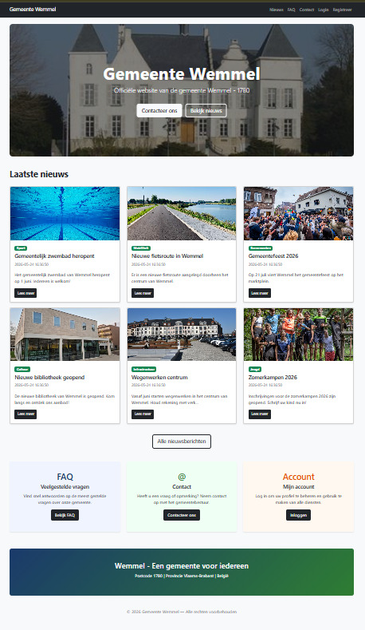
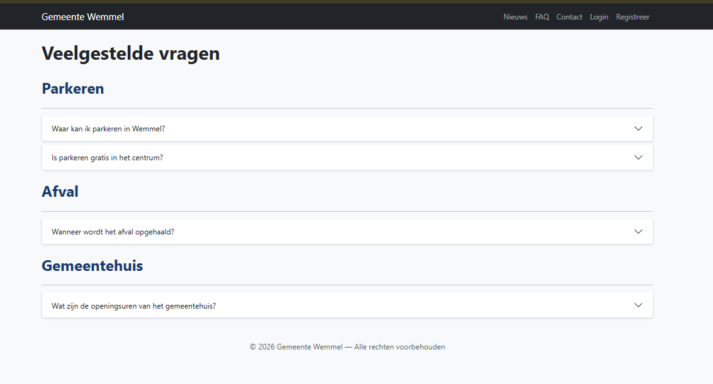
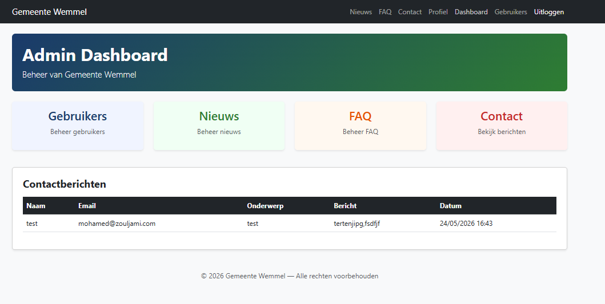
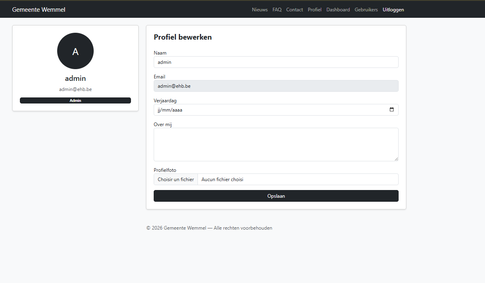

# Gemeente Wemmel - Laravel Project

## Projectbeschrijving
Dit is de officiële website van de gemeente Wemmel (1780), gebouwd met Laravel 13.
De website biedt nieuws, FAQ, contact en gebruikersbeheer voor inwoners en het gemeentebestuur.

## Functionaliteiten
- Login/Register/Uitloggen met Remember me en wachtwoord reset
- Admin en gewone gebruiker rollen
- Profielpagina (publiek + bewerkbaar)
- Nieuws (lijst, detail, CRUD voor admins)
- FAQ met categorieën (CRUD voor admins)
- Contactformulier met email naar admin
- Admin dashboard voor contactberichten
- Commentaarsysteem voor nieuwsitems

## Screenshots

### Homepagina


### Nieuwspagina


### FAQ pagina


### Contact pagina


### Admin Dashboard


### Profielpagina



### Views
- Twee layouts: `resources/views/components/site-layout.blade.php` en `resources/views/layouts/guest.blade.php`
- Components: `x-site-layout` gebruikt in alle views
- Control structures: `@if`, `@foreach`, `@auth` in alle blade bestanden
- XSS protection: Blade `{{ }}` syntax escapet automatisch
- CSRF protection: `@csrf` in alle formulieren
- Client-side validatie: `required`, `minlength`, `type="email"` in alle formulieren

### Routes
- Alle routes gebruiken controller methods: `routes/web.php`
- Middleware: `auth` en `admin` middleware op beveiligde routes
- Gegroepeerde routes: `Route::middleware('auth')->group()` en `Route::prefix('admin')->middleware('admin')`

### Controllers
- `NieuwsController` - nieuws CRUD
- `FaqController` - FAQ CRUD
- `ContactController` - contactformulier
- `ProfileController` - profielbeheer
- `GebruikerController` - gebruikersbeheer
- `DashboardController` - admin dashboard
- `CommentaarController` - commentaren

### Models en relaties
- `User` hasMany `Nieuws`, hasMany `Commentaar`
- `Nieuws` belongsTo `User`, hasMany `Commentaar`
- `FaqCategorie` hasMany `FaqVraag`
- `FaqVraag` belongsTo `FaqCategorie`
- `Commentaar` belongsTo `Nieuws`, belongsTo `User`

### Database
- Migraties: `database/migrations/`
- Seeders: `database/seeders/DatabaseSeeder.php`
- Default data aangemaakt via seeders

### Authentication
- Login/logout/register/remember me/wachtwoord reset
- Default admin: `admin@ehb.be` / `Password!321`

## Installatiehandleiding

### Vereisten
- PHP 8.4
- Composer
- SQLite

### Installatie stappen

1. Clone de repository:
```bash
git clone https://github.com/MohmaedZouljami/Wemmel-project.git
cd Wemmel-project
```

2. Installeer dependencies:
```bash
composer install
npm install
```

3. Kopieer .env bestand:
```bash
cp .env.example .env
php artisan key:generate
```

4. Database aanmaken en seeden:
```bash
php artisan migrate:fresh --seed
```

5. Storage link aanmaken:
```bash
php artisan storage:link
```

6. Start de server:
```bash
php artisan serve
```

7. Ga naar `http://localhost:8000`

### Default admin account
- **Email:** admin@ehb.be
- **Wachtwoord:** Password!321

## Gebruikte bronnen
- Laravel documentatie: https://laravel.com/docs
- Bootstrap 5 documentatie: https://getbootstrap.com/docs$
- Unsplash (gratis foto's): https://unsplash.com
- PHP documentatie: https://www.php.net/docs.php
- Laravel Blade templates: https://laravel.com/docs/blade
- Laravel Authentication: https://laravel.com/docs/authentication


## AI gebruik
AI (Claude van Anthropic) werd gebruikt voor hulp bij de visuele kant van het project,
zoals het opmaken van de pagina's en het stylen van de interface met Bootstrap.
